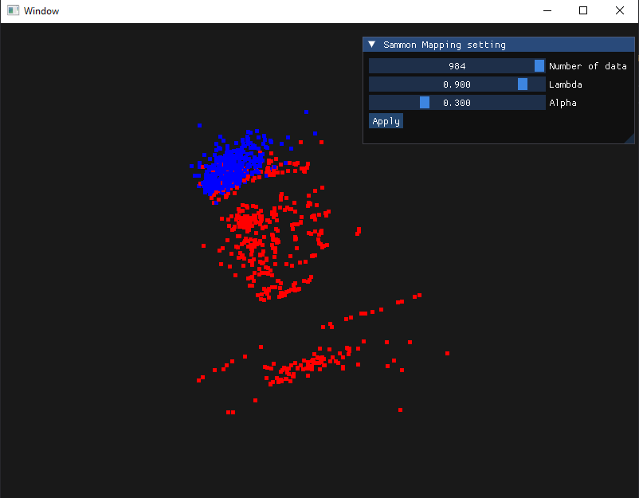

# PREREQUISITES
- vcpkg
- cmake
- set environment variable VCPKG_FEATURE_FLAGS=manifests  

# Sammon Mapping on fraud detection
00957016 高敬庭 
## 完成內容
+ 讀取已知檔案資料(creditcard.dat)，透過Sammon mapping將其分類
+ 使用gui介面調整演算中的lambda以及alpha值

## 結果圖
